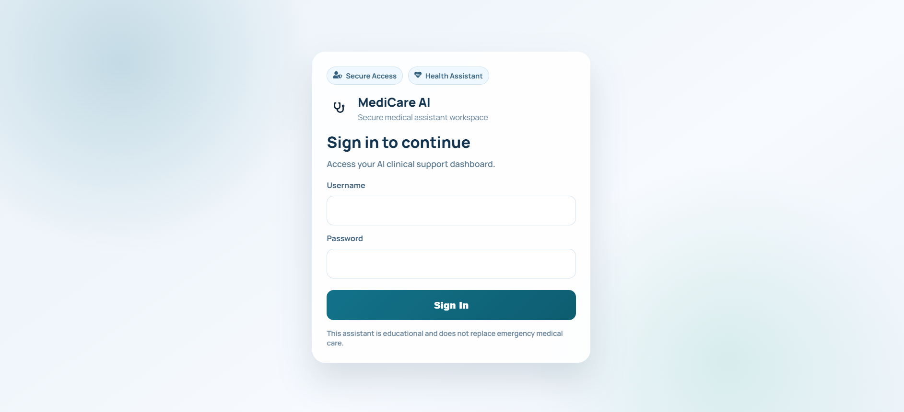
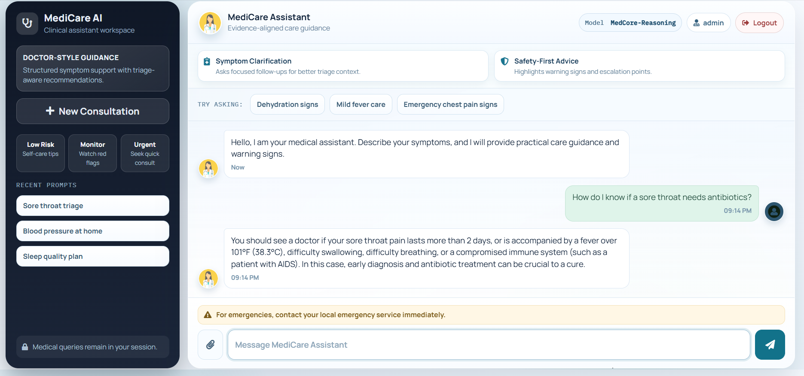
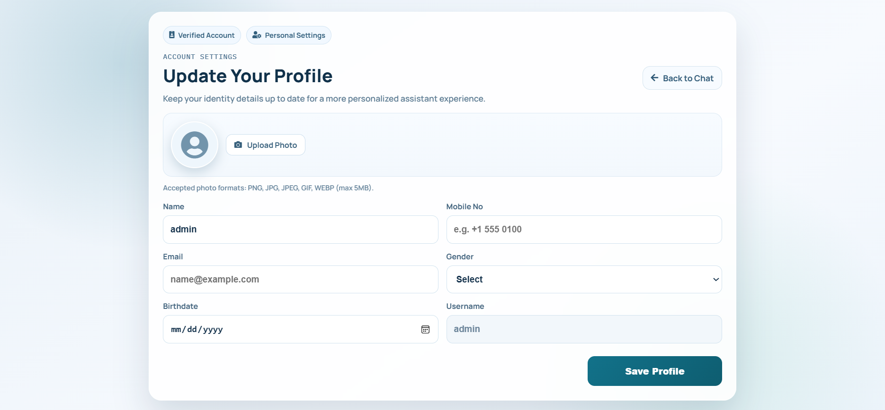
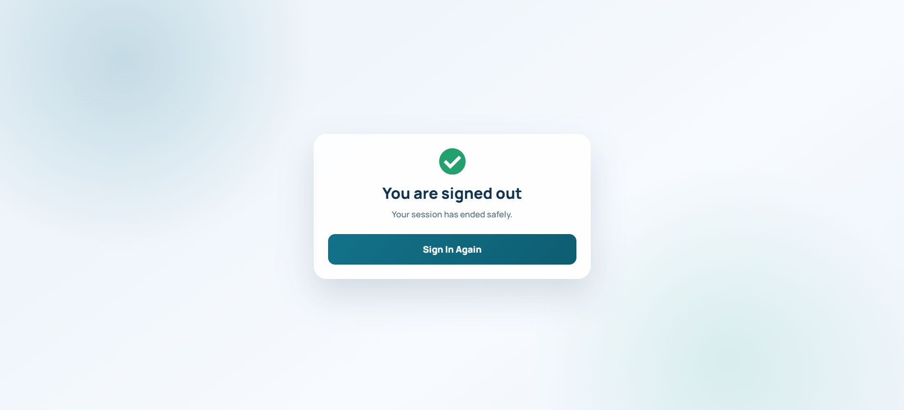

# Medical-Chatbot-with-LLMs-LangChain-Pinecone

Professional AI Health Assistant built with Flask, LangChain, Pinecone, and LLMs.

## How to Run?

### STEPS:

1. Clone the repository

```bash
git clone https://github.com/devpatel1849/Medical-Chatbot-with-LLMs-LangChain-Pinecone.git
cd Build-a-Complete-Medical-Chatbot-with-LLMs-LangChain-Pinecone
```

2. Create a conda environment after opening the repository

```bash
conda create -n medibot python=3.10 -y
conda activate medibot
```

3. Install the requirements

```bash
pip install -r requirements.txt
```

4. Create a `.env` file in the root directory and add your credentials.

```env
PINECONE_API_KEY="xxxxxxxxxxxxxxxxxxxxxxxxxxxxx"

# Use this key if you are using OpenRouter (current app.py expects this)
OPENROUTER_API_KEY="xxxxxxxxxxxxxxxxxxxxxxxxxxxxx"

# Optional/legacy naming (some versions use OPENAI_API_KEY)
OPENAI_API_KEY="xxxxxxxxxxxxxxxxxxxxxxxxxxxxx"

# App auth (optional; defaults exist in code)
APP_USERNAME="admin"
APP_PASSWORD="admin123"
FLASK_SECRET_KEY="change-this-in-production"
```

5. Store embeddings in Pinecone

```bash
python store_index.py
```

6. Run the Flask app

```bash
python app.py
```

Now open in browser:

```text
http://localhost:8080
```

## Techstack Used

- Python
- LangChain
- Flask
- GPT / LLM APIs
- Pinecone

## UI Screenshots

Add your screenshots to `docs/images/` with the following names:

- `login-page.png`
- `chat-dashboard.png`
- `profile-page.png`
- `logout-page.png`

Then they will render in this README:




